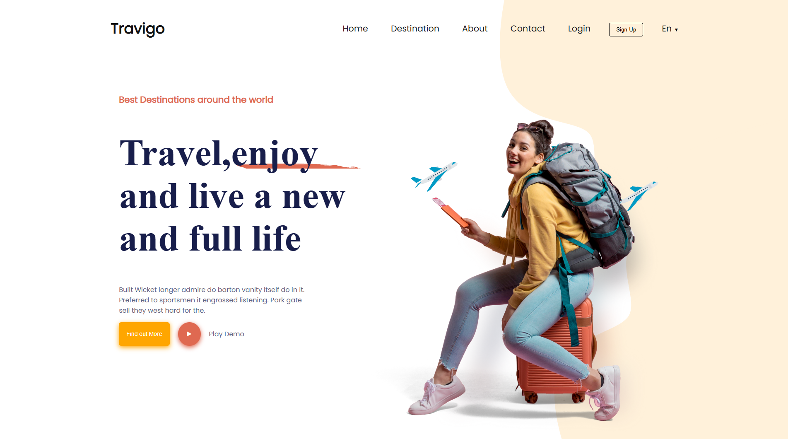

# 🌍 TRAVIGO — Travel Agency Website

## 🧭 Project Context
You are working as a **Web Designer and Developer** at **TRAVIGO**, an agency specialized in organizing **trips, excursions, and stays** around the world.

Your mission is to design and develop the **showcase website** for TRAVIGO, while respecting the brand's **visual identity** and highlighting its services in a clear and attractive way.

---

## 🎨 As a Designer
- Analyzed the provided **Figma mockup** for the homepage and followed the defined **colors, typography, and layout**.  
- Created a **Destinations** page design to present the countries, circuits, and trips offered by the agency.  
- Designed an **About** page highlighting the story, mission, and values of TRAVIGO.  
- Designed a **Contact** page with an interactive form allowing users to ask questions or request quotes.  

---

## 💻 As a Developer
- Converted the **homepage** mockup into a functional web page using **HTML & CSS**.  
- Integrated the **Destinations** page to display travel offers clearly and attractively.  
- Built the **About** page in HTML & CSS to showcase the agency’s history and services.  
- Developed the **Contact** page with a form (name, email, message) that simulates data submission.  
> ⚠️ Note: The website is **not responsive** for mobile or tablet devices yet.

---

## 🧩 Tools & Technologies
- **Figma** – UI/UX design mockup  
- **HTML5** – Website structure  
- **CSS3** – Styling and layout  
- **GitHub Pages** – Project hosting  
- **Trello** – Project management (Agile method)

---

## 📋 Project Management (Agile)
The project was planned and tracked using **Trello**, following Agile principles to ensure smooth progress and on-time delivery.

📌 **Trello Board:**  
👉 https://trello.com/invite/b/68ee123842f140f8862ace3c/ATTI8c979b10862aae2bae50b4b65221d0ab97C055DB/brief-2

---

## 🎨 Figma Design
The homepage design and layout reference were provided as a **Figma mockup**.

🖌️ **Figma Project:**  
👉 https://www.figma.com/design/Y45KjwIDosHNH7jJBzOqcx/travel-website-landing-page-genzdevs-68e7ca81ea486124610984?node-id=0-1&t=rfYKsxtjYoO6V9uG-1

---

## 🖼️ Project Preview
Below is a preview image of the project layout:



---

## 🚀 How to View the Project
1. Clone the repository:
   ```bash
   git clone https://github.com/Parlog07/Travigo-v2.git
